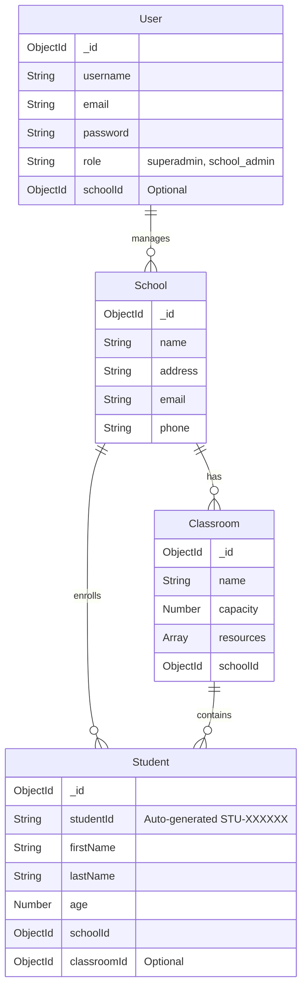

# School Management System API

A robust, enterprise-grade RESTful API built on the `axion` boilerplate for managing school districts, classrooms, and students. This system implements dual-token hybrid authentication, zero-latency Role-Based Access Control (RBAC), and MongoDB data persistence.

---

## 🏗 System Architecture

- **Runtime:** Node.js / Express.js
- **Database:** MongoDB (via Mongoose)
- **In-Memory Store:** Redis / Oyster (used for Token Revocation Blocklist)
- **Security:** JWT Hybrid Refresh Architecture, `express-rate-limit`
- **Testing:** Jest & Supertest

### Schema Diagram



---

## 🔒 Authentication Flow

This API utilizes a **Hybrid Token Architecture** to balance maximum security (rapid expiration) with seamless UX (infrequent logins).

1.  **Login (`/api/user/loginUser`)**: The client authenticates and receives exactly two tokens:
    - `shortToken` (Access Token - Expires in 15 minutes)
    - `longToken` (Refresh Token - Expires in 3 years)
2.  **Protected Requests**: The client passes the `shortToken` in the `token` Header for all subsequent API requests.
3.  **Token Refresh (`/api/token/v1_createShortToken`)**: When the 15-minute `shortToken` expires, the client sends a `POST` request with the 3yo `longToken` in the header. The server verifies the token is not on the Blocklist, and issues a fresh 15-minute `shortToken`.
4.  **Zero-Latency Revocation (`/api/user/logoutUser`)**: If a user is fired or their role is changed mid-session, logging out instantly registers their token's `jti` in the **Oyster (Redis) Blocklist**, permanently rejecting the token globally before it naturally expires.

---

## 🚀 Deployment Instructions

### Local Development (Docker Required for Transactions)

> [!IMPORTANT]
> This API implements **MongoDB ACID Multi-Document Transactions** to guarantee data integrity and prevent race conditions during classroom capacity updates. Transactions strictly require a **MongoDB Replica Set**. A `docker-compose.yml` is provided to instantly spin up a local replica set for testing.

1.  **Start MongoDB Replica Set & Redis**:
    ```bash
    docker compose up -d
    ```
2.  **Install Dependencies**:
    ```bash
    npm install
    ```
3.  **Environment Setup**:
    Configure your `.env` variables from the root folder:
    ```env
    USER_PORT=5111
    LONG_TOKEN_SECRET=your_long_token_secret_here
    SHORT_TOKEN_SECRET=your_short_token_secret_here
    NACL_SECRET=your_nacl_secret_here
    REDIS_URI=redis://127.0.0.1:6379
    MONGO_URI=mongodb://localhost:27017/school_management
    ```
4.  **Run Server & Tests**:
    ```bash
    npm run dev     # Starts with nodemon for auto-reloading
    npm test        # Runs the automated Jest test suite
    ```

### Production Deployment

1. **Database**: Use a managed MongoDB service that supports replica sets natively (e.g., **MongoDB Atlas**).
2. **Hosting**: Deploy the Node.js application to a public hosting service (e.g., Render, Railway, DigitalOcean App Platform, Heroku). Populate the exact Environment Variables within the hosting provider's dashboard.
3. **Caching**: Use a managed Redis instance (e.g., Upstash or Render Redis) and populate the `REDIS_URI`.

---

## 🛡️ ACID Transactions & Race Conditions Mitigation

The system handles race conditions natively for capacity-constrained operations.

When hitting endpoints like `/api/student/createStudent` or `/api/student/transferStudent`, the API updates both the `Student` and `Classroom` documents to strictly enforce capacity limits.
To prevent partial fail states during concurrent requests, these multi-document operations execute inside native **MongoDB Transactions** (`session.startTransaction()`). If two concurrent requests attempt to claim the final classroom seat, MongoDB ensures only one transaction successfully commits while the other safely aborts.

---

## 📡 API Endpoint Specifications

**Global Security**: All `/api/` endpoints are rate-limited to **100 requests per IP every 15 minutes** to prevent Brute force and DDoS capabilities.

**Header Requirements For Protected Routes**:
`token`: `<shortToken>`

### Standard Response Format

**Success**: `{ "ok": true, "data": { ... } }`
**Failure**: `{ "ok": false, "errors": "error message" }`

---

### Authentication API

#### Create User (Superadmin Only)

- **POST** `/api/user/createUser`
- **Body:** `{ "username", "email", "password", "role", "schoolId" (optional) }`
- **Response:** `{ "user", "shortToken", "longToken" }`

#### Login User

- **POST** `/api/user/loginUser`
- **Body:** `{ "email", "password" }`
- **Response:** `{ "user", "shortToken", "longToken" }`

#### Refresh Short Token

- **POST** `/api/token/v1_createShortToken`
- **Header:** `token: <longToken>`
- **Response:** `{ "shortToken" }`

#### Logout & Revoke

- **POST** `/api/user/logoutUser`
- **Header:** `token: <shortToken>`
- **Response:** `{ "success": true, "message": "Token successfully revoked" }`

---

### Schools API (RBAC: Superadmin)

#### Create School

- **POST** `/api/school/createSchool`
- **Body:** `{ "name", "address", "email", "phone" }`

#### Fetch Schools

- **GET** `/api/school/getSchools`
- **Body:** `{ "page"?, "limit"? }` (Pagination defaults to `page=1, limit=10`)

#### Check Specific School

- **GET** `/api/school/getSchool`
- **Body:** `{ "id" }` (note: `axion` handles GET params in JSON body or query equivalent)

#### Update School

- **PATCH** `/api/school/updateSchool`
- **Body:** `{ "id", "name"?, "address"?, "email"?, "phone"? }`

#### Delete School

- **DELETE** `/api/school/deleteSchool`
- **Body:** `{ "id" }`

---

### Classroom API (RBAC: Superadmin & School Admin)

_Note: School Admins are securely restricted in backend logic to only modifying/viewing Classrooms whose `schoolId` matches their own._

#### Create Classroom

- **POST** `/api/classroom/createClassroom`
- **Body:** `{ "name", "capacity", "schoolId", "resources"? }`

#### Get Classrooms

- **GET** `/api/classroom/getClassrooms`
- **Body:** `{ "schoolId"?, "page"?, "limit"? }` (Ignored if School Admin. Pagination defaults to `page=1, limit=10`)

#### Get Specific Classroom

- **GET** `/api/classroom/getClassroom`
- **Body:** `{ "id" }`

#### Update Classroom

- **PATCH** `/api/classroom/updateClassroom`
- **Body:** `{ "id", "name"?, "capacity"?, "schoolId"? }`

#### Add Resource

- **POST** `/api/classroom/addResource`
- **Body:** `{ "id", "name", "quantity" }`

#### Remove Resource

- **DELETE** `/api/classroom/removeResource`
- **Body:** `{ "id", "resourceId" }`

#### Delete Classroom

- **DELETE** `/api/classroom/deleteClassroom`
- **Body:** `{ "id" }`

---

### Student API (RBAC: Superadmin & School Admin)

_Note: School Admins are strictly scoped to only managing their own students._

#### Create Student

- **POST** `/api/student/createStudent`
- **Body:** `{ "firstName", "lastName", "age", "schoolId", "classroomId"? }`

#### Get Students

- **GET** `/api/student/getStudents`
- **Body:** `{ "schoolId"?, "classroomId"?, "page"?, "limit"? }` (Pagination defaults to `page=1, limit=10`)

#### Get Specific Student

- **GET** `/api/student/getStudent`
- **Body:** `{ "id" }`

#### Update Student Profile

- **PATCH** `/api/student/updateStudent`
- **Body:** `{ "id", "firstName"?, "lastName"?, "age"? }`

#### Transfer Student

- **PATCH** `/api/student/transferStudent`
- **Body:** `{ "id", "newClassroomId"?, "newSchoolId"? }`
- _Security Note: School Admins can only transfer students to a `newClassroomId` within their own school. Superadmins can transfer students to completely different schools using `newSchoolId`._

#### Delete Student

- **DELETE** `/api/student/deleteStudent`
- **Body:** `{ "id" }`

---

## ❌ Error Codes & Handling

- `200 OK`: Request succeeded.
- `400 Bad Request`: Validation failure (missing inputs, bad strings).
- `401 Unauthorized`: Token missing, `jwt malformed`, or `token revoked` via Oyster Blocklist.
- `403 Forbidden`: `role` inside Token has insufficient permissions for the endpoint route.
- `429 Too Many Requests`: Triggered by `express-rate-limit` exceeding 100 API calls / 15 mins.
- `500 Internal Server Error`: Generic unhandled promise catch.
